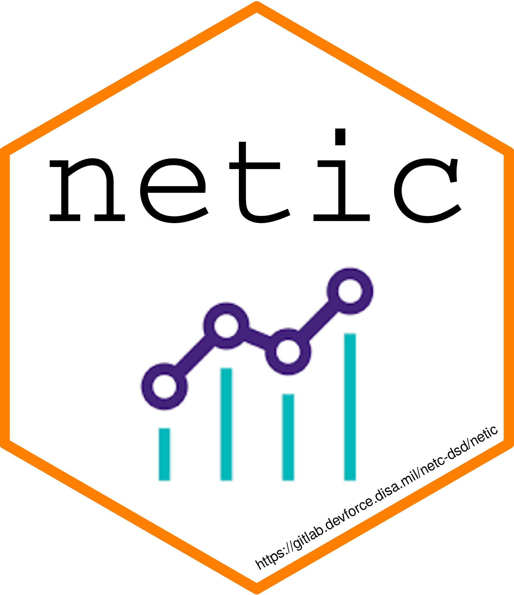
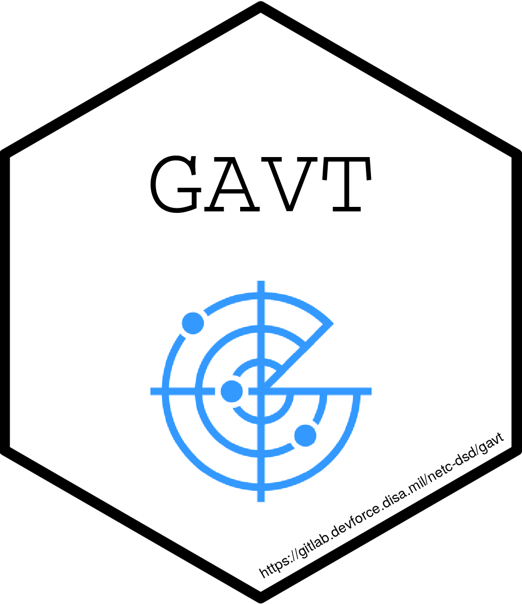
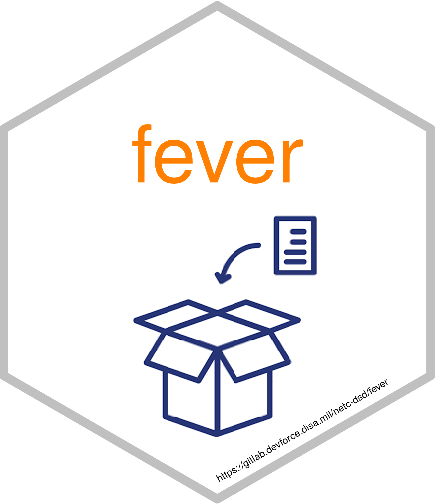
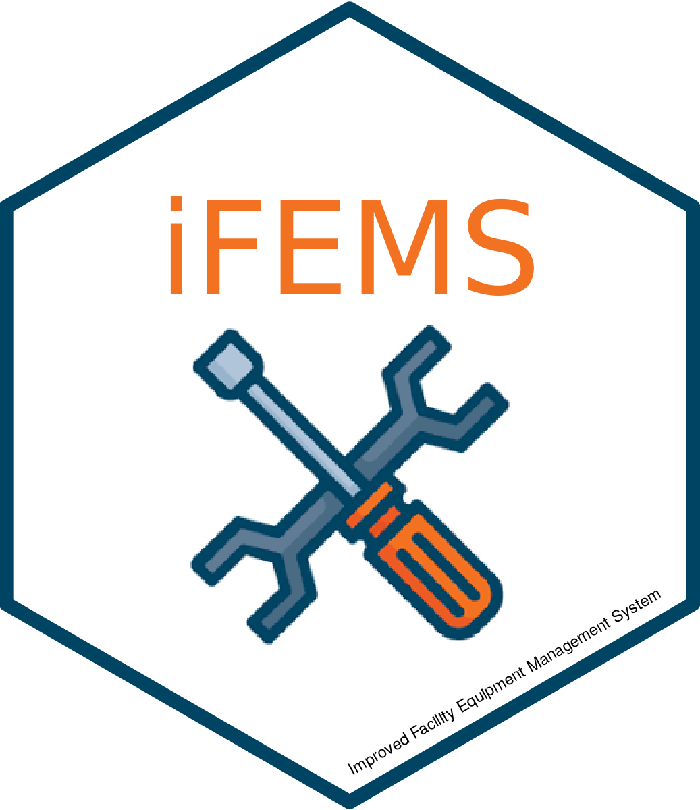
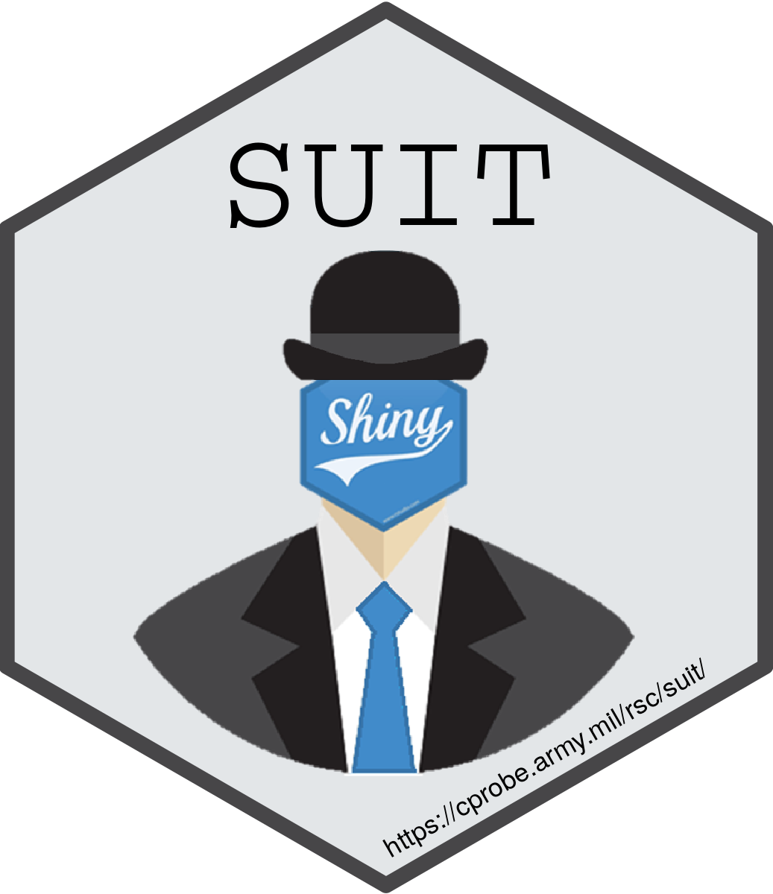

# Hi, my name is Evan Munson

[][twitter]
[][LinkedIn]
[][ORCID ID]

### About me

* My primary coding language is:  R
* I enjoy developing R packages.
* I have also started to enjoy developing Shiny Applications.
* I studied Operations Research in graduate school which started me down the path to be a data scientist.

### My Projects

#### Personal

[][saotd]

#### Professional (access will require a DevForce account)

[][netic]
[][gavt]
[][fever]
[][ifems]
[][suit]

### Some of my favorite Tech Tools

 
 
 
 
 
 
 
 
 
 

### My todo list

* Updating my [`saotd`](https://github.com/evan-l-munson/saotd) package and resubmitting it to CRAN.
* Learning and becoming familiar with:  Python

[twitter]: https://twitter.com/spot2ring
[linkedin]: https://www.linkedin.com/in/evan-munson-50033b61/
[ORCID ID]: http://orcid.org/0000-0002-9958-6800
[saotd]: https://github.com/evan-l-munson/saotd
[netic]: https://gitlab.devforce.disa.mil/netc-dsd/netic
[gavt]: https://gitlab.devforce.disa.mil/netc-dsd/gavt
[fever]: https://gitlab.devforce.disa.mil/netc-dsd/fever
[ifems]: https://gitlab.devforce.disa.mil/netc-dsd/ifems
[suit]: https://gitlab.devforce.disa.mil/netc-dsd/suit
