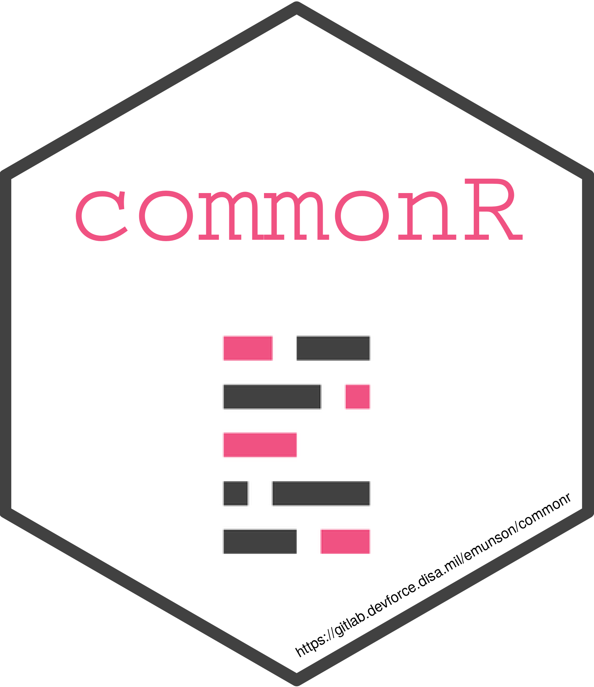
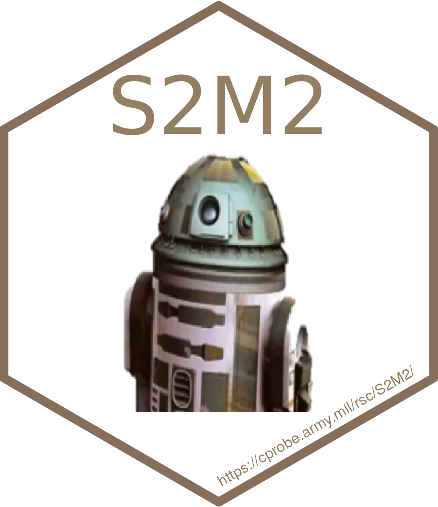

# Hi, my name is Evan Munson

[][twitter]
[][LinkedIn]
[][ORCID ID]

### About me

* I am an experienced Data Scientist and Manager of Analytic Projects.
* My primary coding language is:  R
* I enjoy developing R packages and Shiny Applications!
* I studied Operations Research in graduate school which started me down the path to be a Data Scientist.
* Look here for my [resume](https://evan-l-munson.github.io/elm_resume/)!

### My Projects

#### Personal

[][saotd]
[][suit_public]

#### Professional (access will require a DevForce account)

[][netic]
[][gavt]
[][commonR]
[][fever]
[][ifems]
[][suit]
[][gpa]
[][s2m2]

### Some of my favorite Tech Tools

 
 
 
 
 
 
 
 
 
 
 

### My todo list

* Continuing to improve my [`saotd`](https://github.com/evan-l-munson/saotd) package with additional capabilities and features.
* Learn and Explore the `tidymodels` package framework.
* Learn and becoming familiar with:  Python

### GitHub Stats

[twitter]: https://twitter.com/spot2ring
[linkedin]: https://www.linkedin.com/in/evan-munson-50033b61/
[ORCID ID]: http://orcid.org/0000-0002-9958-6800
[saotd]: https://github.com/evan-l-munson/saotd
[netic]: https://gitlab.devforce.disa.mil/netc-dsd/netic
[gavt]: https://gitlab.devforce.disa.mil/netc-dsd/gavt
[commonR]: https://gitlab.devforce.disa.mil/emunson/commonr
[fever]: https://gitlab.devforce.disa.mil/netc-dsd/fever
[ifems]: https://gitlab.devforce.disa.mil/netc-dsd/ifems
[suit]: https://gitlab.devforce.disa.mil/netc-dsd/pmo/suit
[gpa]: https://gitlab.devforce.disa.mil/netc-dsd/pmo/gpa
[s2m2]: https://gitlab.devforce.disa.mil/netc-dsd/pmo/s2m2
[suit_public]: https://github.com/evan-l-munson/SUIT
